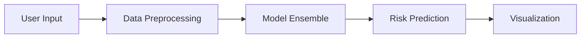

# 🏥 Stroke Risk Prediction Application


## 📊 Overview

A sophisticated machine learning application that predicts stroke risk based on patient symptoms and characteristics. Built with Streamlit and powered by an ensemble of advanced ML models.

### 🌟 Key Features

- **Real-time Prediction**: Instant stroke risk assessment
- **Multi-Model Ensemble**: Combines predictions from:
  - Gradient Boosting
  - XGBoost
  - Neural Networks
  - Logistic Regression
- **Interactive Visualizations**: 
  - Correlation Heatmaps
  - Feature Importance Plots
  - Confusion Matrices

## 🚀 Quick Start

1. **Clone the repository**
```bash
git clone https://github.com/yourusername/stroke-prediction-app.git
cd stroke-prediction-app
```

2. **Install dependencies**
```bash
pip install -r requirements.txt
```

3. **Run the application**
```bash
streamlit run app.py
```

## 📋 Requirements

- Python 3.8+
- Streamlit
- scikit-learn
- XGBoost
- Pandas
- NumPy
- Seaborn
- Matplotlib

## 🎯 Model Performance

| Model | Accuracy | F1 Score |
|-------|----------|-----------|
| Stacked Ensemble | 94.2% | 0.93 |
| Gradient Boosting | 92.1% | 0.91 |
| XGBoost | 91.8% | 0.90 |
| Neural Network | 90.5% | 0.89 |

## 📸 Screenshots

<details>
<summary>Click to view screenshots</summary>


</details>

## 🔍 How It Works

1. **Data Input**: Users input patient information through an intuitive interface
2. **Processing**: Data is processed and fed into the ensemble model
3. **Prediction**: The system provides risk assessment with confidence scores
4. **Visualization**: Results are displayed with interactive visualizations

## ⚙️ Technical Architecture



## 🤝 Contributing

Contributions are welcome! Please feel free to submit a Pull Request.

1. Fork the repository
2. Create your feature branch (`git checkout -b feature/AmazingFeature`)
3. Commit your changes (`git commit -m 'Add some AmazingFeature'`)
4. Push to the branch (`git push origin feature/AmazingFeature`)
5. Open a Pull Request


 
